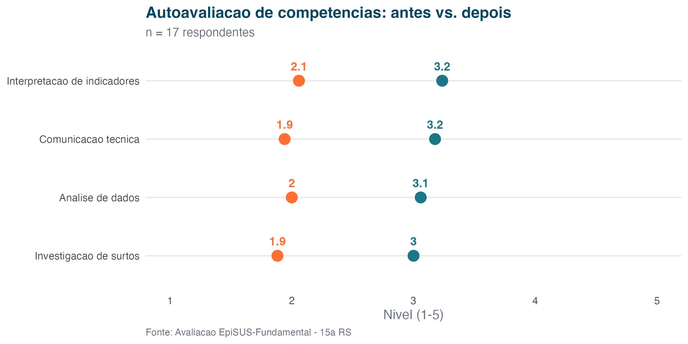
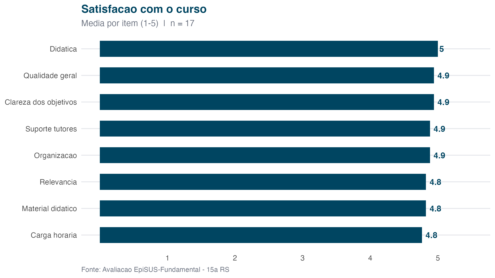
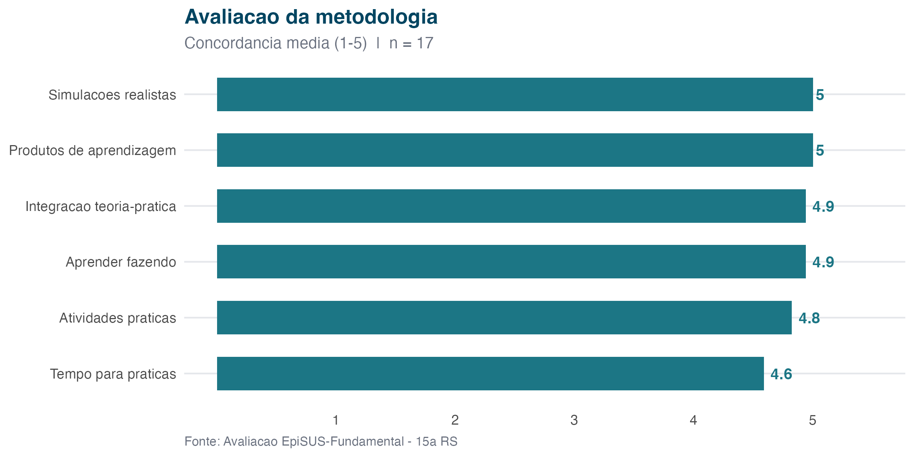
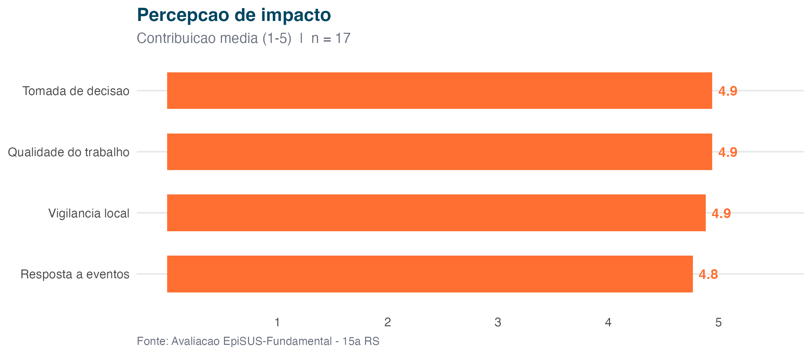
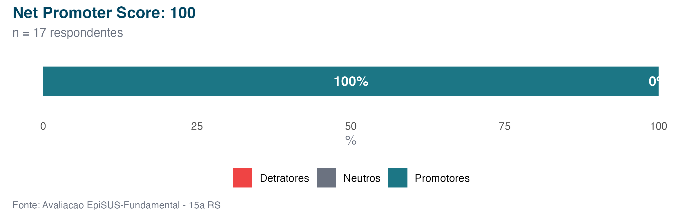
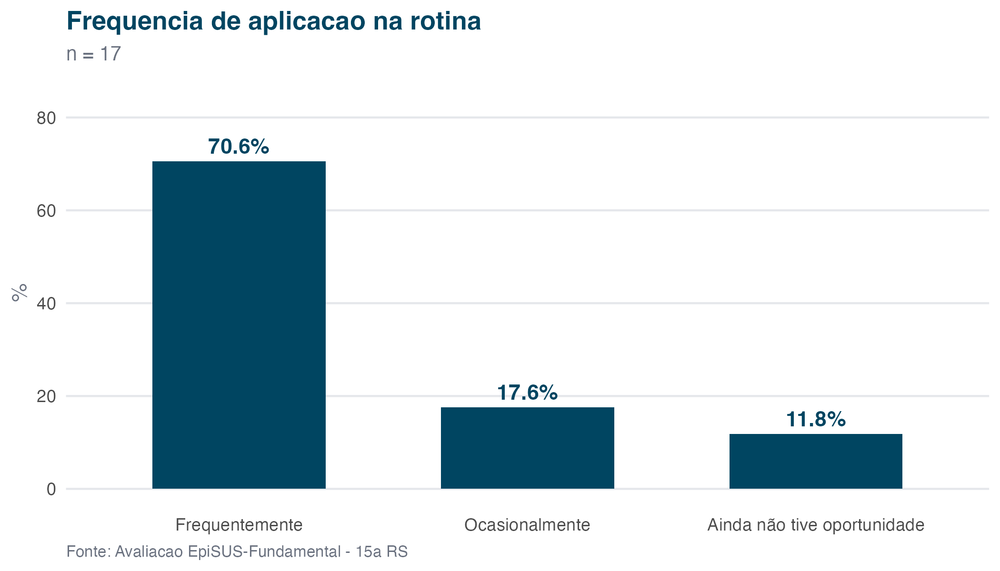
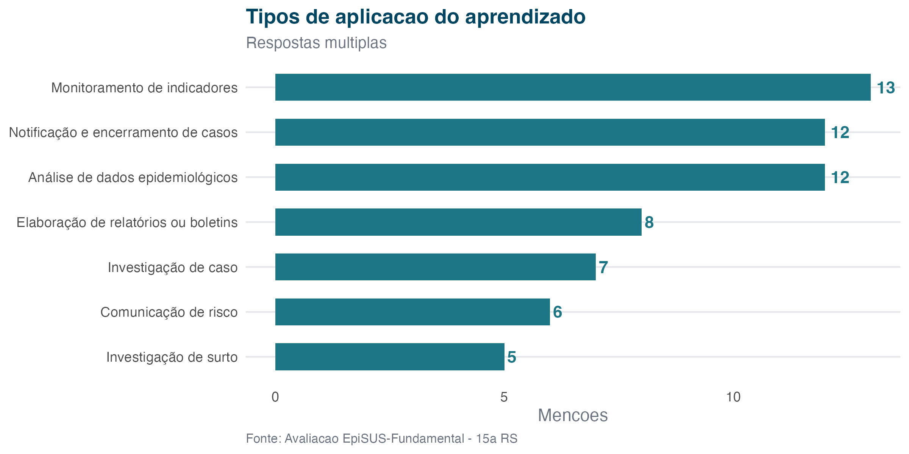
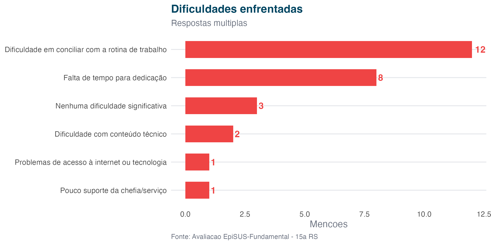

## Autoavaliacao pre vs. pos

{width=100%}

## Satisfacao com o curso

{width=100%}

## Avaliacao da metodologia

{width=100%}

## Percepcao de impacto

{width=100%}

## Net Promoter Score

{width=100%}

## Aplicacao na rotina

{width=100%}

## Tipos de aplicacao

{width=100%}

## Dificuldades enfrentadas

{width=100%}

---

*Gerado automaticamente em 2026-04-13 - Secao de Vigilancia Epidemiologica, 15a RS de Maringa.*
