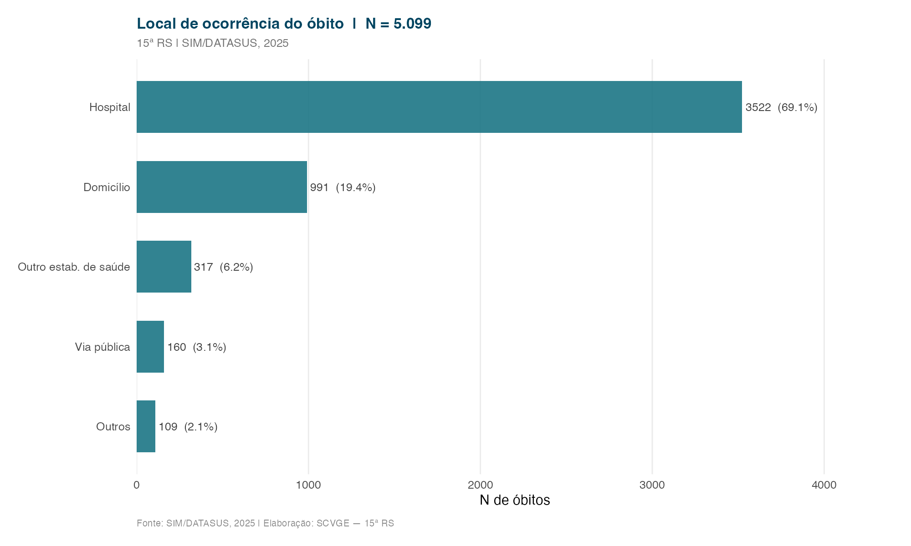
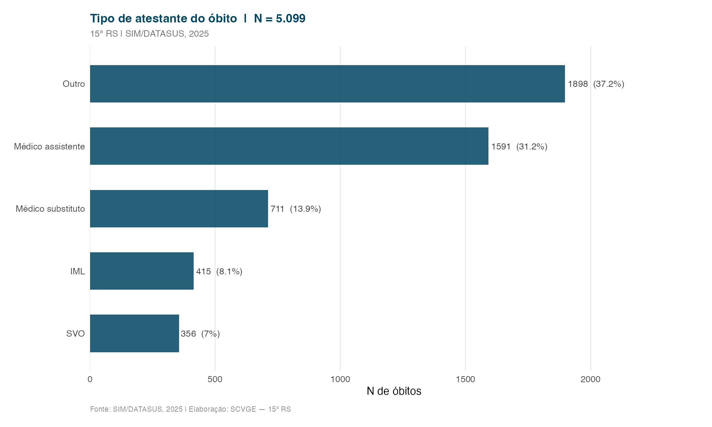

Indicadores relacionados à assistência recebida pelo falecido e ao local onde ocorreu o óbito.

---

## Local de ocorrência do óbito

::: {.callout-note}
A proporção de óbitos ocorridos em domicílio e via pública pode indicar dificuldades de acesso aos serviços ou falhas no cuidado à saúde.
:::

---

## Tipo de atestante do óbito

::: {.callout-note}
Alta proporção de óbitos atestados por IML e SVO pode indicar elevada mortalidade por causas externas e/ou subqualidade da assistência médica prestada antes do óbito.
:::
