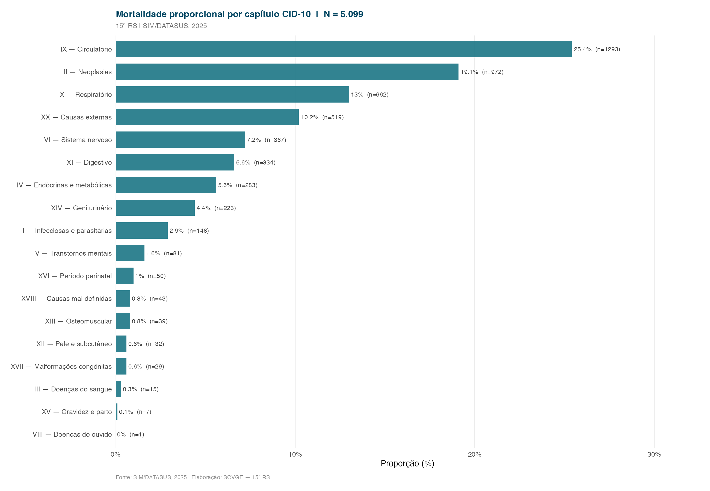
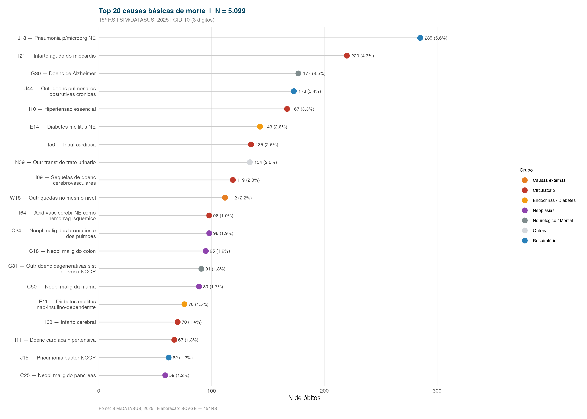
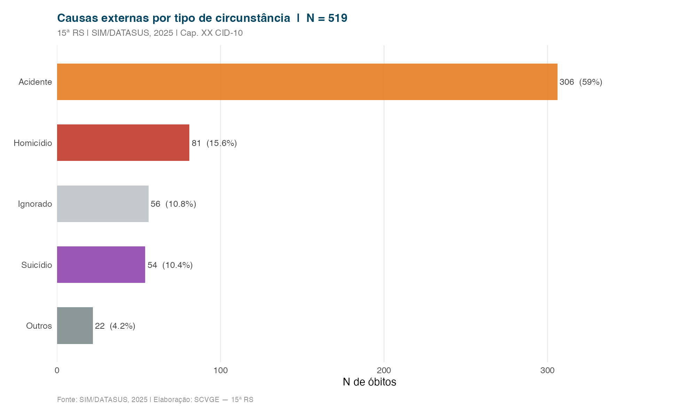

Análise das causas básicas de morte registradas na 15ª RS, classificadas segundo os capítulos da CID-10.

---

## Mortalidade proporcional por capítulo CID-10

---

## Top 20 causas básicas

As 20 causas básicas de morte mais frequentes na 15ª RS, identificadas pelo código CID-10 de três dígitos.

---

## Causas externas por tipo de circunstância

::: {.callout-note}
As causas externas englobam acidentes, violências e lesões autoprovocadas (capítulo XX da CID-10: V01–Y98). O tipo de circunstância é registrado no campo `CIRCOBITO` da Declaração de Óbito.
:::
