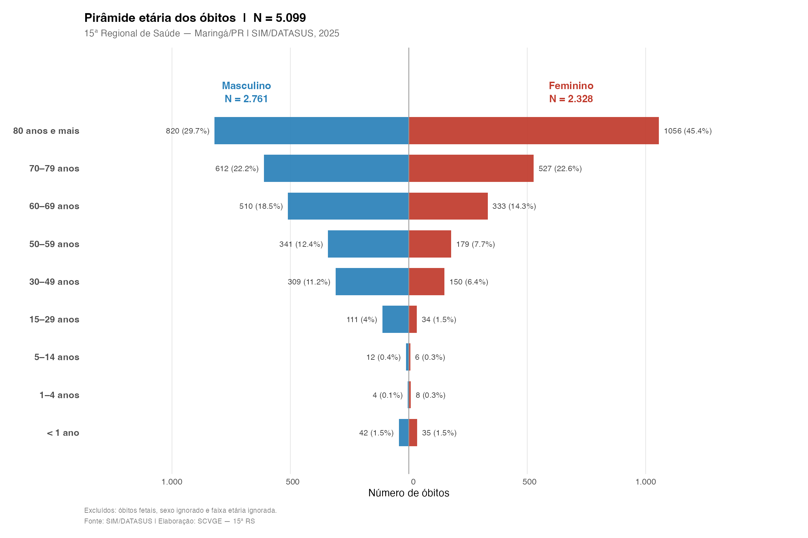
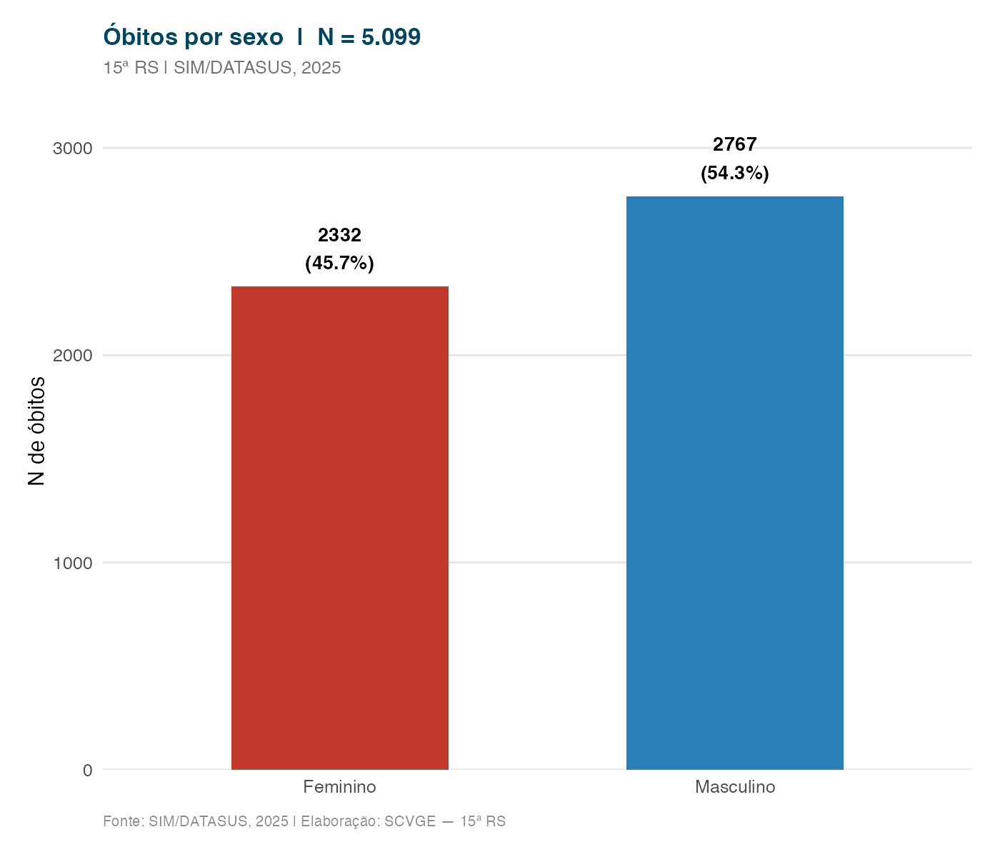
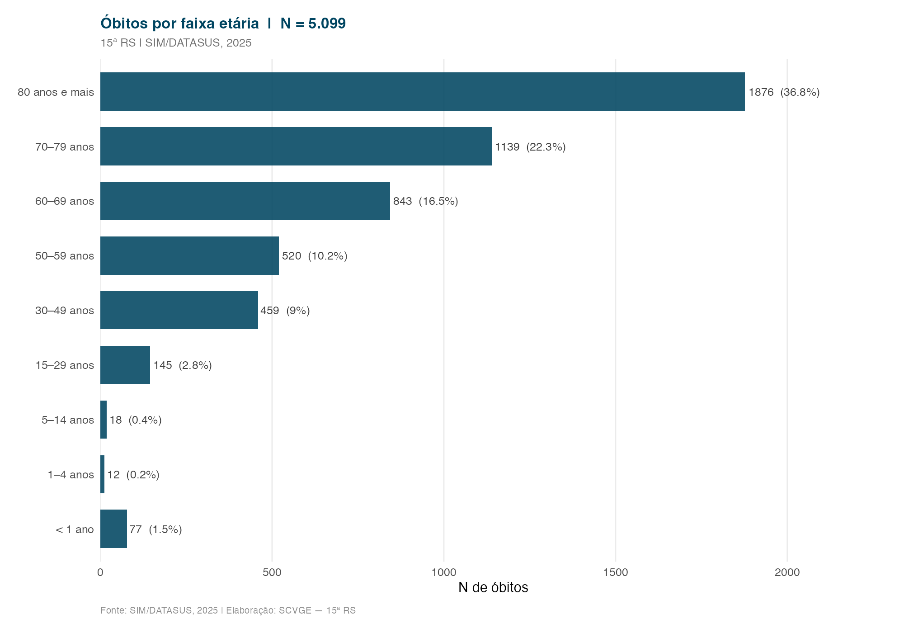
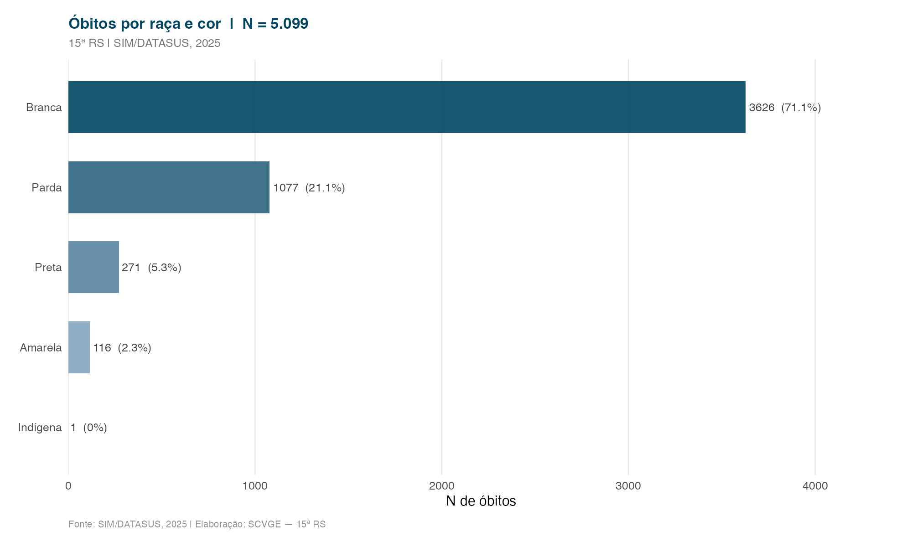

Análise do perfil dos óbitos não fetais registrados na 15ª RS, segundo sexo, faixa etária, raça/cor e escolaridade.

---

## Pirâmide etária

A pirâmide etária apresenta a distribuição por faixa etária segundo o sexo. Em populações com transição epidemiológica avançada, espera-se concentração nas faixas mais velhas.

---

## Distribuição por sexo

---

## Distribuição por faixa etária

---

## Distribuição por raça e cor

::: {.callout-note}
A variável raça/cor é autodeclarada pelo responsável pelas informações do falecido no momento do preenchimento da Declaração de Óbito.
:::
