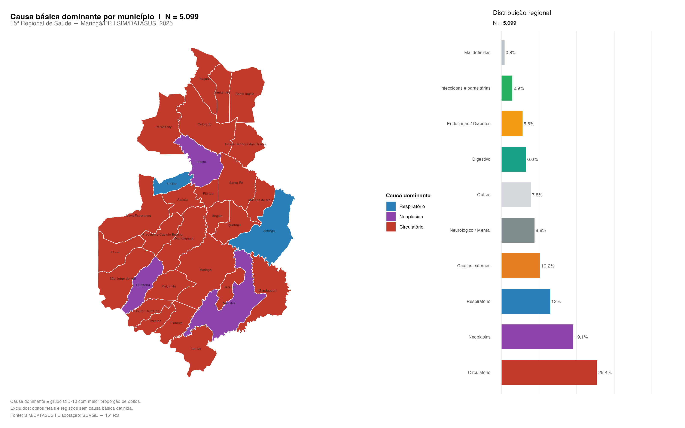
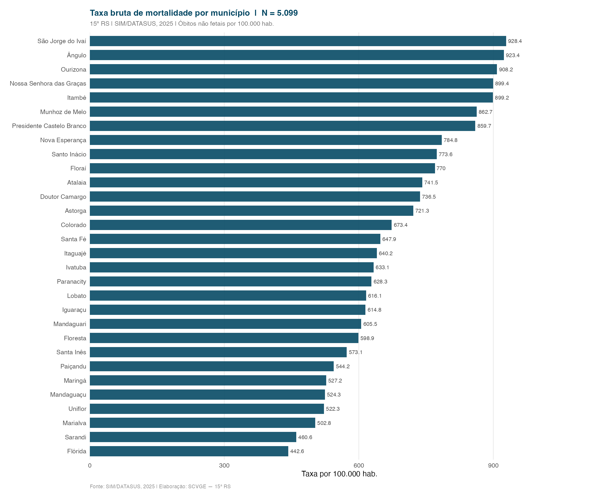
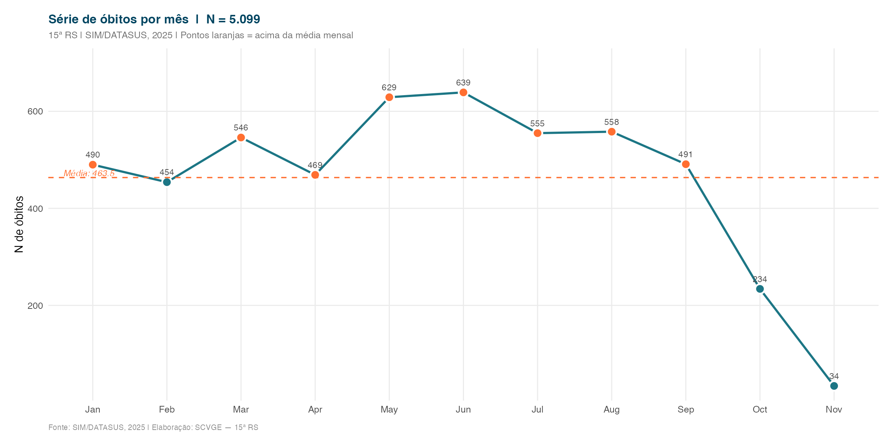

Distribuição geográfica dos óbitos entre os 30 municípios da 15ª RS. A taxa bruta é calculada com base nas estimativas populacionais IBGE 2025.

---

## Mapa: causa básica dominante por município

---

## Taxa bruta de mortalidade por município

Óbitos não fetais por 100.000 habitantes.

---

## Série mensal de óbitos

