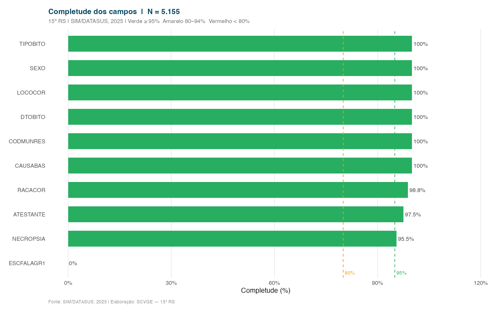

Avaliação da qualidade dos registros do SIM na 15ª RS, considerando completude dos campos obrigatórios e proporção de causas mal definidas.

---

## Completude dos campos

A completude mede a proporção de registros com cada campo devidamente preenchido. A meta de referência é ≥ 95% para campos obrigatórios (RIPSA).

::: {.callout-tip}
**Referências de qualidade (RIPSA):**

- **≥ 95%** — adequado
- **80–94%** — regular, requer atenção
- **< 80%** — inadequado, requer intervenção
:::

---

## Causas mal definidas

Causas mal definidas correspondem aos óbitos com causa básica classificada no Capítulo XVIII da CID-10 (R00–R99). Proporções elevadas indicam falhas no processo de certificação médica.

::: {.callout-note}
Meta de referência: **< 10%** (RIPSA/SVS)
:::
