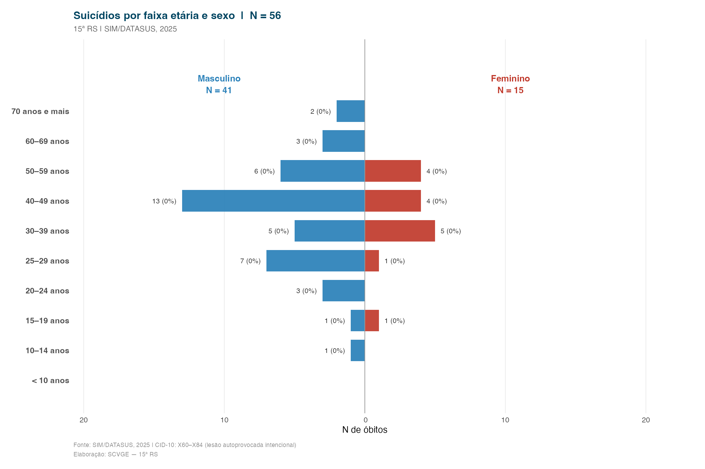
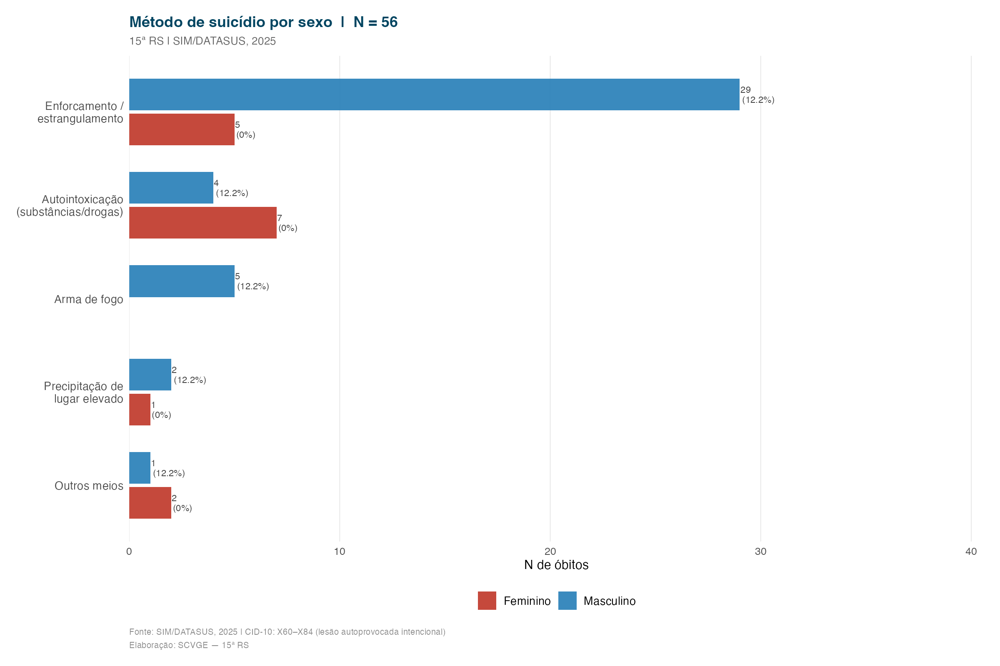
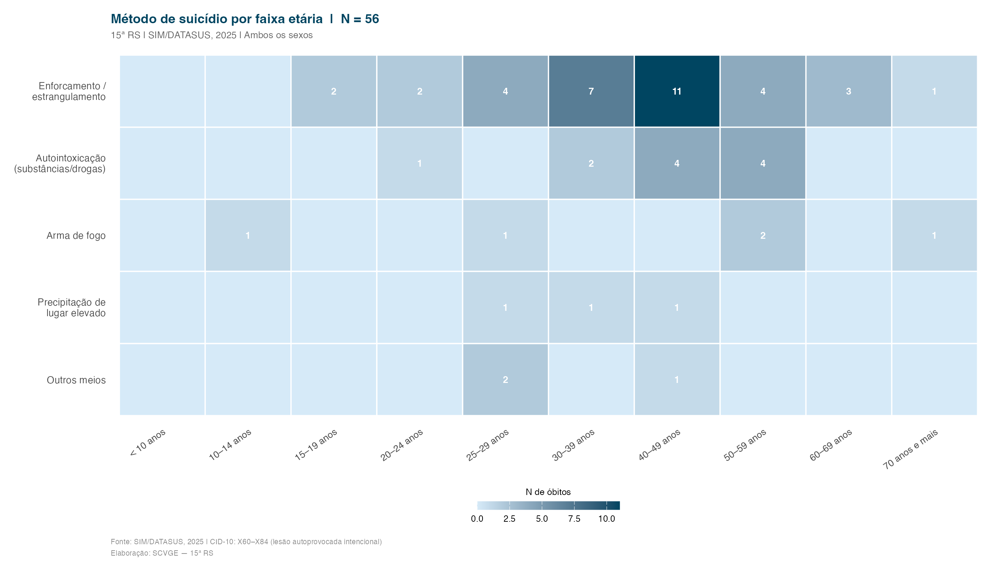

::: {.callout-warning}
**Atenção:** Este conteúdo trata de mortalidade por suicídio com finalidade exclusivamente epidemiológica e de vigilância em saúde.

Se você ou alguém que conhece está em sofrimento, o **CVV (Centro de Valorização da Vida)** atende 24h pelo telefone **188** ou em [cvv.org.br](https://cvv.org.br).
:::

Dados referentes a óbitos com causas do grupo **X60–X84** da CID-10 (lesões autoprovocadas intencionalmente), registrados no SIM/DATASUS para os municípios da 15ª RS.

---

## Pirâmide etária dos suicídios por sexo

---

## Método utilizado por sexo

---

## Método por faixa etária

---

## Nota metodológica

Os casos foram identificados a partir do código de causa básica (`CAUSABAS`) do arquivo DBC do SIM, filtrando os códigos X60 a X84 da CID-10. Excluídos registros com sexo ignorado.
